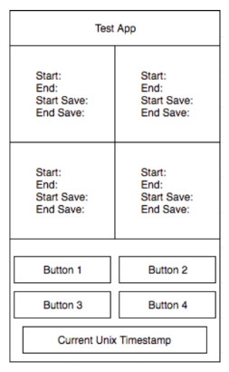
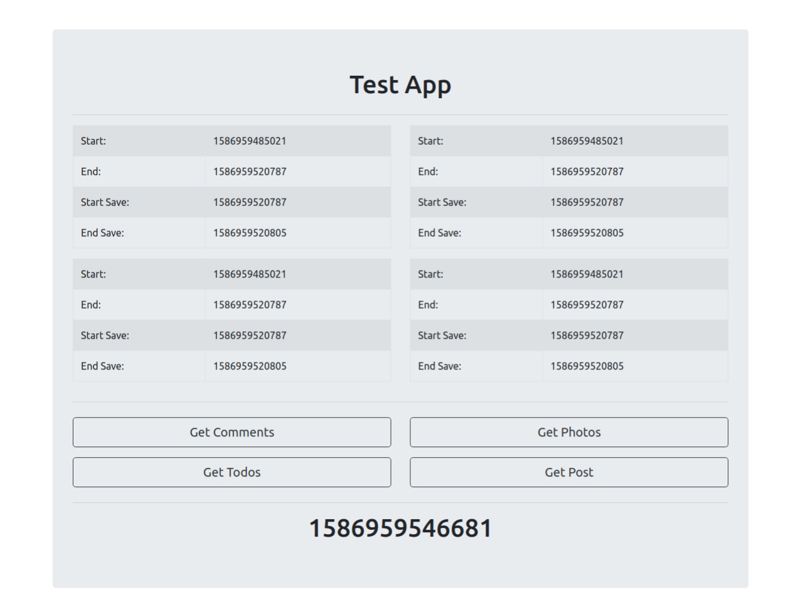

# ReactJS Assignment - Samagra

## Problem Statement

You have to make a single page web application which will download data from the following urls1 simultaneously (and record the timestamp of the start and end of the request) and save it in IndexedDB using models of your choice (and save the timestamp of start and end of the saving time). The UI of the app will be as shown below.

The four Urls should be pinged at the same time (5-sec delay after opening the Activity) and the recorded times (timestamps) have to show in the UI under the heads of

- [x] Start: When you ping the Url
- [x] End: When you finish parsing the Url
- [x] Start Save: When you start saving the Data
- [x] End Save: When you end saving the data

[ **Demo** ](https://samagra.now.sh/)

### Tech / Stack -

- HTML5
- Bootstrap
- JavaScript
- React
- Redux & JSON
- JSONPlaceholder API

### Features implemented -

- [x] fetch data from multiple APIs simultaneouly
- [x] stored data into LocalStorage
- [x] Unix Timestamp

### Required UI -

### ScreenShot -

### Instructions to Run

### `npm install`

### `npm start`

Runs the app in the development mode.
Open [http://localhost:3000](http://localhost:3000) to view it in the browser.

This project was bootstrapped with [Create React App](https://github.com/facebook/create-react-app).
